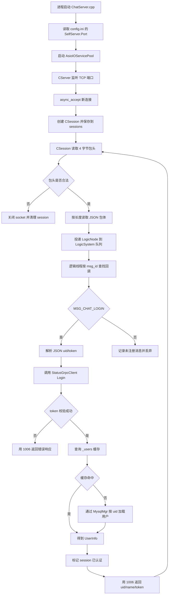

# ChatServer 项目逻辑梳理

## 项目定位

`ChatServer` 是聊天系统里的 TCP 长连接服务。客户端从 `GateServer` 登录成功后拿到 `ChatServer` 的 `host`、`port` 和 `token`，再连接本服务。本项目当前实现了基础的连接接入、固定包头拆包、异步发送队列和登录消息回显逻辑。

## 核心流程图

## 文字说明

程序入口在 `ChatServer.cpp`。启动后先读取当前工作目录下的 `config.ini`，从 `[SelfServer] Port` 决定监听端口，然后创建 `AsioIOServicePool` 作为连接读写的 IO 线程池。主 `io_context` 只负责监听新连接和处理退出信号。

`CServer` 构造完成后立即发起 `async_accept`。每接入一个客户端，服务会从 IO 线程池取一个 `io_context` 创建 `CSession`，让该连接后续的读写事件运行在线程池中。`CServer` 用 `_sessions` 保存活跃连接，防止 `CSession` 在异步回调完成前被释放。

`CSession` 使用固定 4 字节应用层包头：前 2 字节是消息 ID，后 2 字节是包体长度，均为网络字节序。读包过程固定为 `AsyncReadHead -> AsyncReadBody -> PostMsgToQue -> AsyncReadHead`。这样可以处理 TCP 粘包、半包问题，并在每个完整包处理后继续读取下一包。

业务处理由 `LogicSystem` 独立线程完成。网络线程只负责收包、发包和投递任务，避免 JSON 解析或后续数据库、RPC 等耗时逻辑阻塞 IO。当前注册的业务消息是 `MSG_CHAT_LOGIN = 1005`，包体是 JSON，至少包含 `uid` 和 `token`。服务会调用 `StatusGrpcClient::Login(uid, token)` 向 `StatusServer` 校验 token；校验成功后继续从 `_users` 内存缓存读取用户信息，缓存未命中时通过 `MysqlMgr::GetUser(uid)` 查询 MySQL。

`StatusGrpcClient` 读取 `[StatusServer] Host/Port` 配置，复用 `GateServer` 目录下生成的 `message.pb.*` 和 `message.grpc.pb.*`，通过 `StatusService.Login` 完成服务间校验。如果 JSON 无法解析、uid/token 缺失、RPC 失败、token 不匹配或用户信息不存在，`ChatServer` 会用 `MSG_CHAT_LOGIN_RSP = 1006` 返回非 0 错误码，并保持 session 未认证。成功响应包含 `uid`、`name` 和 `token`，供客户端写入用户管理对象。

发送侧通过 `_send_que` 保证同一连接上同时只有一个 `async_write`。如果已有写操作正在进行，新消息只入队；当前写完成后再继续发送下一条，避免多个异步写交错导致响应包顺序错乱。

## 关键文件

- `ChatServer.cpp`：进程入口、配置读取、信号处理和服务启动。
- `CServer.*`：TCP 监听、连接接入、会话生命周期管理。
- `CSession.*`：应用层协议拆包、收包、投递逻辑队列、异步回包。
- `LogicSystem.*`：业务回调注册、逻辑队列消费、登录消息处理。
- `StatusGrpcClient.*`：调用 `StatusServer` 校验登录 token。
- `MysqlMgr.*` / `MysqlDao.*`：按 uid 从 MySQL 加载用户信息。
- `AsioIOServicePool.*`：多 `io_context` 线程池。
- `const.h`：协议常量、消息节点和逻辑节点定义。
